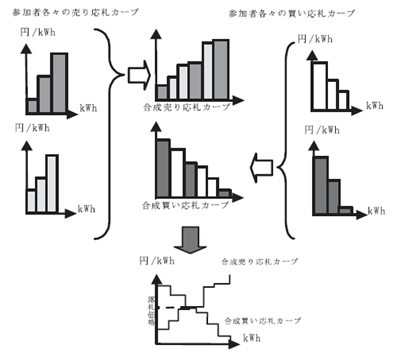

# 京都大学ソーシャルイノベーションセンター ブロックチェーン実証実験事業

Author: [株式会社 CauchyE](https://cauchye.com/) [大村瀬奈](https://twitter.com/crypto_senna)

## ブロックチェーン実証実験事業

株式会社 CauchyE と京都大学ソーシャルイノベーションセンター（以下、KyotoUniv-SIC）の共同事業では以下の 2 つを現在、実施しています。

- リップルのバリデーターノードの管理及び XRP 取引データの分析によるバブル形成と崩壊の予測に関する研究事業

- リップル ブロックチェーン(XRP Ledger)による電力管理システムの構築と実証実験事業

## XRP Ledger 運用と取引データを用いた研究事業

現在、米リップルが展開する大学ブロックチェーン研究イニシアチブ（University Blockchain Research Initiative：UBRI）に国内では東京大学と京都大学の 2 校が加入しており、京都大学ではこれに KyotoUniv-SIC の[ブロックチェーン研究センター](https://blockchain.innovationkyoto.org/)が参加しております。

この UBRI への加入に伴い、KyotoUniv-SIC では 2019 年 11 月 13 日に日本の大学としては初のリップルブロックチェーン (XRP Ledger)のバリデーターノードを運用開始しており、これの管理・運用を株式会社 CauchyE が受託し、実施しております。このノードはバリデータとしてネットワークに参加し、トランザクションの検証や承認を担う役割を持ちます。

また、KyotoUniv-SIC ブロックチェーン研究センターの池田裕一研究室ではこのバリデータが持つ XRP の取引データを解析することでバブル形成と崩壊を数理的に予測するための研究を実施しています。また、機械学習による詐欺や資金洗浄などの異常検出の研究も実施しております。

## 電力管理システムの構築と実証実験事業

電力管理システムの構築と実証実験事業では EDISON (Energy DIstribution SystemON KyotoUniv-SIC) という 1Kwh あたりの電力をトークン化し、利用者同士で取引できる電力管理システムの構築に向けて、開発を行っています。

EDISON はこれまでの月末に電気使用量に応じた電気料金を支払うシステムではなく、電気使用権をトークンとして取引し、消費するシステムです。EDISON では以下の 2 種類のトークンが実装されています。

- SPX (Solar Power XRP Token): KyotoUniv-SIC の建物のソーラーパネルで発電された電気 1kWh を消費できるトークン
- UPX (Utility Power XRP Token): 電力会社から購入した電気 1kWh を消費できるトークン

利用者はこれら 2 つのトークンを利用者同士の市場で取引し、日々の電気消費に使用します。大学からの販売価格は

$$
SPX>UPX
$$

とし、電気使用量やその中における SPX の割合をリーダーボードでの表示を行います。また、何らかの形でのインセンティブを付与することで、利用者に対し、電気使用量やクリーンエネルギーの割合を可視化することで省エネ意識の向上や電気料金の透明化を図ります。

このシステムの取引には XRP Ledger（リップルのブロックチェーン）を用いています。また、ソフトウェア側は Google によって開発されているフロントエンド Web アプリケーションフレームワークである Angular と、Google Cloud 上のデータベースである Firestore を用いて開発を行っています。

https://github.com/KyotoUniv-SIC/electoric-power-exchange

## 今後のスケジュール

- 2022 年 1 月~ 3 月 EDISON テスト公開
- 2022 年 4 月~ 2023 年 3 月 EDISON 実証実験
- 2023 年 ~ University of Pennsylvania との共同研究？

今後のタイムスケジュールとしては、2022 年 1 月～ 3 月に EDISON のテストを実施予定となっています。試験的にシステムを稼働し、不具合の改善やシステム改良を行います。

そのテストを経て、2022 年度に実際に KyotoUniv-SIC 所管の学生寮の寮生に利用してもらう形での実証実験を実施する予定です。実証実験ではデータ収集を行い、利用者の行動にどのような変化が現れたかについて分析する予定です。

また、同じく UBRI に所属する University of Pennsylvania の Dr. Dorit Aviv のチーム([BlockPenn](https://thermal-architecture.org/blockpenn))では個人が環境に与える負荷をポイントで評価するシステムをスマートコントラクトで実装する研究が実施されており、時期は未定ですが、共同研究を予定しております。

## EDISON における取引の詳細

EDISON のシステムにおける電気使用権取引

### 月初のトークン発行

前述のようにトークン 1 個は電力量 1kwh を消費できる権利とします。
UPX のトークン価格$\bar{U}$(円/kWh)は電気会社の電気料金と同じ $27$ (円/kWh)とします。
SPX については月初の発行はなく、毎日の発電量に応じて、管理者が市場で販売します

月初のトークン発行数は，人数 × 前年同月の一人当たりの平均使用電力量の一定割合(例えば 90%)に相当する$N$です。
この時点でのシステムの収入は$I=N\bar{U}$となります。

### 月中のトークン発行と取引

月中には KyotoUniv-SIC のソーラーパネルで発電された電気を SPX トークンとして市場にて販売します。全体でトークンが不足する場合は月初発行トークンと比べて価格を高く設定した UPX トークンも販売します。これによるシステムの収入を$S$とします。

利用者同士はシングルプライスオークションを採用した、電気使用権取引市場による取引を行います。

#### シングルプライスオークション方式

- それぞれの売り手の応札情報から作成した売り応札曲線
- それぞれの買い手の応札情報から作成した買い応札曲線

これら二つの曲線の交点で落札価格と落札量が決まります。交点より左側にある応札（落札価格より安値の売りと落札価格より高値の買い）はすべて成約し、交点より右側の考察は全て成約されません。

### 月末の精算

$n$個の余剰トークンは，システム側が価格$p$で買い取り、$m$個の不足トークンは，システム側が価格$q$で販売します。

$p< \bar{U}< q$とすると、

$$
p = (1 - r) \bar{U} \tag{1}
$$

$$
q = (1 + r) \bar{U} \tag{2}
$$

システムの運用コストを$C$、システムが電力会社に支払う電気料金を$E$とし、システムの収支を 0 とすると、

$$
I + S - C - E - np + mq = 0 \tag{3}
$$

となります。式(1)~(3)より

$$
r = \frac{- (I + S - C - E - n\bar{U} + m\bar{U})}{(n+m)\bar{U}}   \tag{4}
$$

となります。
